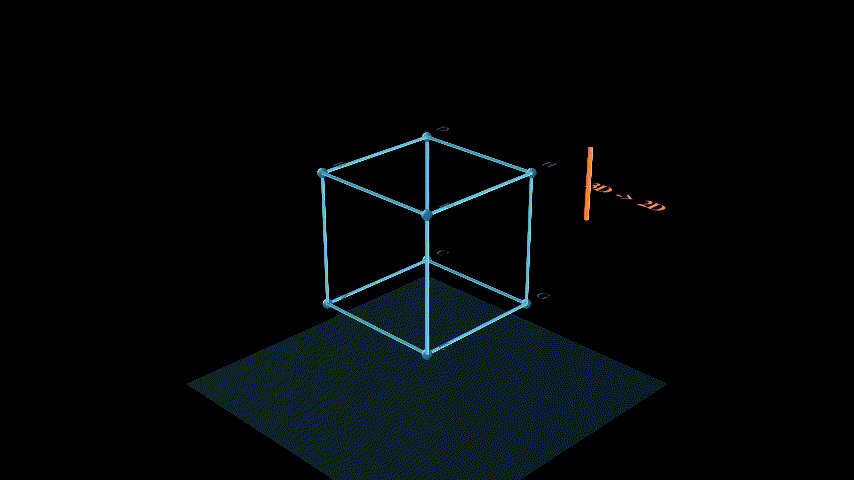
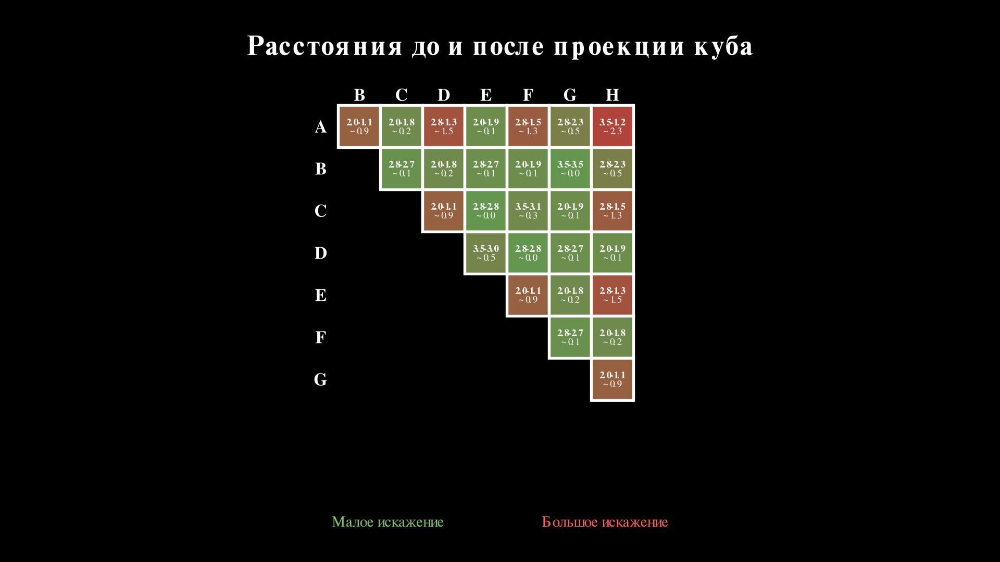
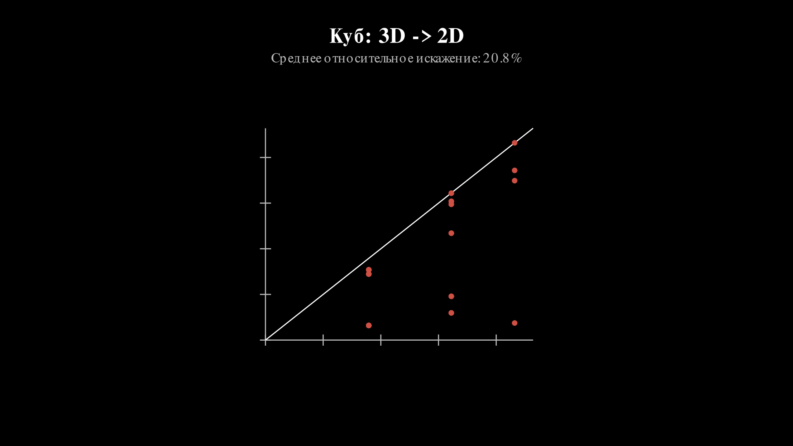
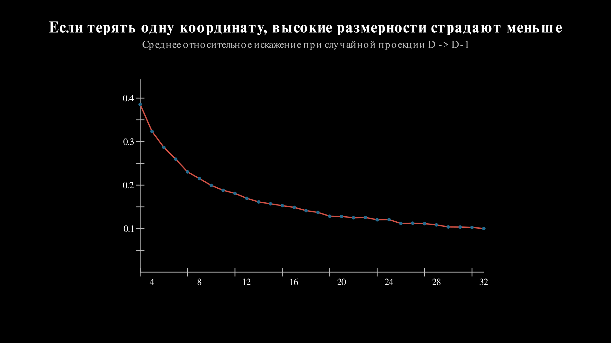
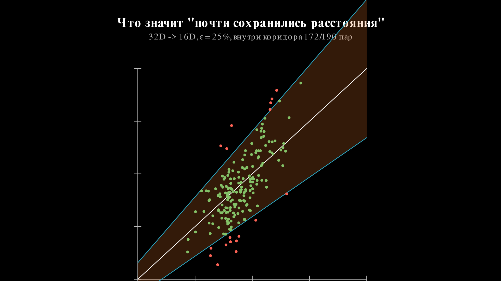

# Почему случайная проекция не совсем магия

Помним ту недавнюю статью? Под капотом там из математики лемма Джонсона и Линденштрауса, которая звучит круто, но на слух почти магически.

Если очень грубо, утверждение такое: если у тебя есть много точек в пространстве очень высокой размерности, их можно спроецировать в пространство намного меньшей размерности, и при этом все попарные расстояния между точками почти не изменятся.

Чё? Меняем количество размерностей вниз и расстояние между точками сохраняется? Давайте проверим это на картинках.

Каждая вершина "падает" вниз, и на плоскости возникает плоская тень куба.

Теперь посмотрим на конкретное ребро. Выделим `CE` и покажем, как оно переходит в `C'E'`:

У этих точек одинаковая координата `z`, так что здесь проекция вообще ничего не теряет:

$$
|CE| = \sqrt{2^2 + (-2)^2 + 0^2} = \sqrt{8}
$$

$$
|C'E'| = \sqrt{2^2 + (-2)^2} = \sqrt{8}
$$

Обалдеть, оно работает? Не совсем. Если посчитать все `28` попарных расстояний между вершинами куба до и после проекции, становится видно, что часть расстояний схлопывается заметно сильнее других.

По горизонтали и вертикали на рисунке стоят вершины `A-H`. В каждой заполненной ячейке написано `до - после`, а строкой ниже показано, насколько расстояние схлопнулось. Цвет ячейки тоже показывает величину искажения: чем зеленее, тем меньше проекция врёт; чем краснее, тем сильнее всё поехало.

Вот тут уже становится видно, что никакой магии нет: для некоторых пар точек геометрия искажается сильно.

Но куб это вообще не самый удачный кандидат на роль "типичных данных". Он слишком регулярный, слишком игрушечный и слишком жёстко привязан к своим осям. Поэтому давайте посмотрим на среднее относительное искажение у куба:

Теперь возьмём столько же случайных точек, примерно в таком же диапазоне попарных расстояний, но уже в `4D` и `5D`, и сравним одиночные прогоны:

Из одного прогона вывод делать рано: выборка маленькая, шум заметный. Но интуиция уже начинает проступать. Когда ты теряешь одну координату из трёх, это болезненно. Когда теряешь одну координату из пяти, потеря уже не выглядит такой драматичной.

Если посмотреть на зависимость искажения от целевой размерности, картинка становится понятнее:

Это ещё не формулировка самой леммы, а только разминка перед ней. Но уже видно главное: чем выше исходная размерность, тем менее катастрофичной становится потеря небольшого числа направлений.

Проблема в том, что среднее искажение само по себе немного жулик. Оно может выглядеть прилично, даже если несколько пар точек уже улетели в кювет.

Поэтому вводим более жёсткий критерий. Берём допуск $\varepsilon$ и говорим: нас устраивает только такая проекция, где для каждой пары точек новое расстояние $d'$ попадает в коридор вокруг старого $d$:

$$
(1 - \varepsilon)d \le d' \le (1 + \varepsilon)d
$$

На графике "до и после" это просто клин вокруг диагонали $d' = d$. Чем меньше $\varepsilon$, тем уже клин и тем вреднее проверка.

Вот теперь можно честно формализовать, что значит "почти не изменились". В классической записи лемма Джонсона-Линденштрауса говорит: для любого набора из $n$ точек и любого $0 < \varepsilon < 1$ существует отображение в $k$ измерений такое, что для любых двух точек $u, v$:

$$
(1 - \varepsilon)\|u - v\|^2 \le \|f(u) - f(v)\|^2 \le (1 + \varepsilon)\|u - v\|^2
$$

То есть все попарные расстояния сохраняются с мультипликативной ошибкой не больше $\varepsilon$.

А дальше начинается самое интересное. Нужная размерность $k$ растёт не от исходной размерности пространства, а примерно как логарифм числа точек, делённый на $\varepsilon^2$. В одной из стандартных оценок достаточно взять:

$$
k \ge \frac{4 \log n}{\varepsilon^2 / 2 - \varepsilon^3 / 3}
$$

Вот где и сидит настоящий прикол. Тебе не нужно тащить исходные `10000` или `100000` координат. Если точек конечное число, а небольшое искажение допустимо, то пространство можно ужать очень сильно, не убив геометрию полностью.
